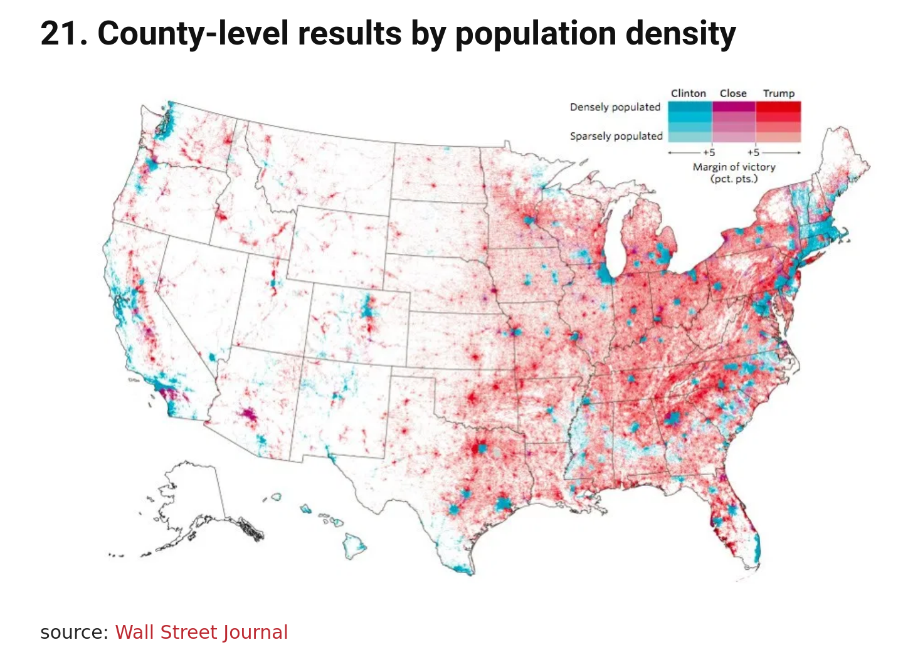
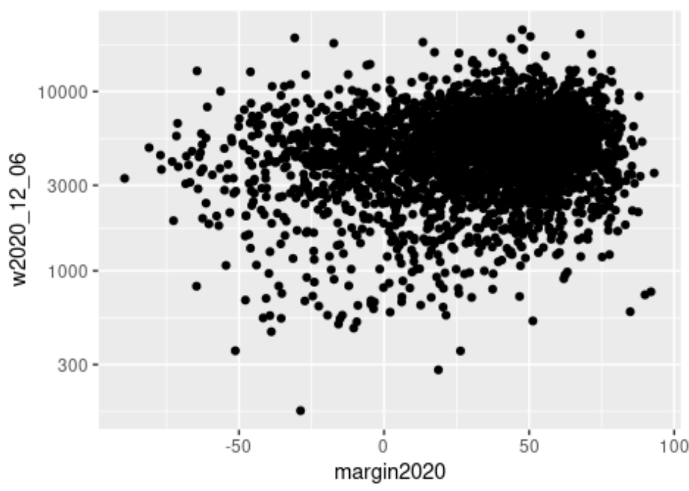

# 
Vector-in-Chief

### 
 Election Margins by County and COVID Case-Totals:
### 
 Tracking Correlations Over Time 

## Background 
- Overall USA case-counts:
	- 17.5 million cases in the USA total accumulated by Dec 19 2020 (NYT)
	- 330 million total population in the USA in Dec 2020 (census.gov/popclock)
	- 5.3 % of Americans have been counted as a COVID case by Dec 2020
- Vote margins
	- 

## Results

#### COVID case totals vs vote margins, by county in mid-August 
Biden counties on left had more COVID back in August.

#### COVID case totals vs vote margins, by county in early December 
Trump counties on right have more COVID in December.

#### Case-Totals/Vote-Margin Correlation (Slope of Scattergraph) By Week

 

- Have Trump-leaning counties been getting sicker than Biden-leaning counties? How much sicker?
	- The regression coefficient of 10 on the chart implies the following magnitude of correlation:
		- For each additional percentage point that a county leaned Trump, the county now has 10 extra cases. 
		- That is, 1 case per 10k population per %-point:
		- 10 extra cases / 100,000 population / 1 %-point (Trump vote% - Biden vote%)
	- In summary, 
		- an average county today that had voted 60% for Trump and 40% for Biden (+20% margin),
		- compared to a 60%-40% Biden county (-20% margin),
		- has experienced (40 * 10 / 100k) = 
		- **0.4% more COVID cases**, which is almost a tenth of the nationwide 5% average case rate.

## Discussion
- How is this trending moving forward?
	- And as you can see in the first chart, this trend continues to exacerbate today, despite the fact that the virus itself spreads in a non-partisan way.
	
## Moving Forward
- What do I need to do next to substantively improve this analysis?
	- Add a control variable for counties with early spikes in COVID cases in March and April to see how that affects the results. (Rob's idea!)
	- Weight the regression by county populations, to give the magnitude of the results more relevance.
	- Dig into econometric methods that control for spatial autocorrelation
	- Hunt down a dataset of mayoral elections, to use close-elections to try to identify an exogenous effect of partisan mayorships.
	- Analyze weekly new-cases with time-series tools to support the cumulative-case-count outcome analysis.
- What do I need to do to improve the quality and relevance of my data?
	- Get the final vote counts. They were still missing some 2% of ballots from remaining mail-in ballots when I got this data, the NYT github site is down now.
	- Calculate my own vote-margins instead of using NYT's vote-margins
	- Use death data also
- What do I need to do to improve the quality of my presentation
	- Put it on rpubs like Elli (🤩)