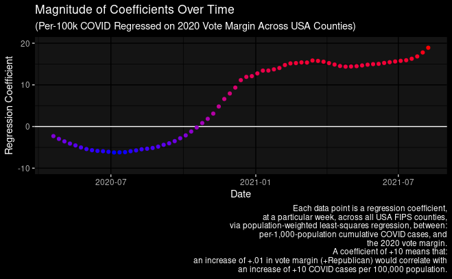

<style type="text/css">

h1.title {
  padding-top: 2em;
  text-align: center;
}
h3.subtitle {
  text-align: center;
}
h4.author {
  font-size: 1em;
  text-align: center;
}
h4.date {
  font-size: 1em;
  text-align: center;
}

#homeLink {
  font-size: 1.5em;
  color: #CCCCCC !important;
  opacity: 1;
  width: 5em;
	height: 1.2em;
  position: absolute;
  top: 3%;
  left: 50%;
  transform: translate(-50%, 0%);
}
hr{
  height: 1px;
  background-color: #FFF;
  border: none;
}
.center_plots {
  font-size: 1em;
  text-align: center;
  margin: auto;
  width: 70%;
}
.width_auto {
  margin: auto;
  width: 100%;
}
</style>


<div id="homeLink"><a href="../index.html"><p align="center">
bhrdwj.net
<br>
潘
</p></a></div>

## Abstract
<br>
In Spring and Summer of 2020, predominantly Democratic-voting counties suffered the worst of the first COVID wave. But after the Fall and the election passed, the winter saw much worse COVID in Republican-leaning counties. Without engaging "what-caused-what", I analyze the magnitude and time-evolution of the pandemic/politic naive correlation.

<br>
<hr> ## Plots

<div class="center_plots">
#### Cross-Section Scatterplots, Population-Weighted Regression
<br>

*Democratic-leaning areas initially had more COVID.*
<br><br>

<br><br>

*Balanced COVID at the moment of the election.*
<br><br>

<br><br>

*To date, Republican-leaning areas have accumulated more COVID overall.*
<br><br>

<br>
</div>

<div class="width_auto">
<br><hr><br>
</div>

<div class="center_plots">
#### Time Series Plots
<br>

<br>
</div>

<div class="center_plots">
<br>

<br>
</div>

<div class="width_auto">
<br><hr> 
</div>


<div class="center_plots">
#### Within-State and Between-State Coefficient Significance Over Time
<br>

<br>
</div>

<div class="center_plots">
#### Time Series Plot of Cumulative COVID Per 1000 Population
<br>

<br>
</div>


<div class="width_auto">
<br><hr> 
</div>


## Discussion

#### Overview
Each plotted point on the time series graph represents a cross-section regression coefficient, taken at a point in time. The coefficient measures a correlation at that time across the cross-section of all USA FIPS counties, and this is done every week.

The coefficient measures correlation between:

 - per-1,000-population cumulative COVID cases, and
 - the 2020 presidential election vote margin in decimals

Of course, the 2020 vote margin doesn't change, only the cumulative count of COVID cases can change. And, the cumulative counts can never decrease, by definition. When a trend appears, such as counties that voted more-Republican having suffered more cumulative COVID cases, then the coefficient will increase with that trend.

Note that the coefficient was negative in early 2020, when counties that voted more-Democrat initially experienced greater vulnerability to the virus.  Then that switched to the opposite in Fall 2020. 

#### Magnitude of the Effect
The maximum correlation of Democratic areas and cumulative severity of COVID occurred the second week of August 2020, at 8 COVID-cases per 100,000 population per percentage point of presidential vote-margin. By the first week of November, it was balanced. The maximum Republican correlation is also the latest correlation, at 19 cases per 100,000 per % vote-margin.

Overall in the USA today, one in ten USA residents has tested positive for COVID. So, an additional 20 out of 100,000 population represents a 0.2% difference in the total level of cumulative COVID cases. On 2021-08-08, the R² is 0.054 and the p-value on is 3E-39.

#### Why?

It cannot be overemphasized that *there is no information about causality in this study!*  The correlations here could be due to any number of biological, socioeconomic, or geographic factors.

This analysis merely (albeit confidently) shows that Democratic-leaning counties were *somehow* more vulnerable to COVID in Spring 2020. Then, that trend *fully reversed*, and since Fall 2020 Republican-leaning counties have *somehow* experienced overall greater vulnerability to COVID. 

To interpret this information more thoroughly, engaging issues of mask-wearing behavior, social-distancing, vaccines, the overall socioeconomic landscape, etc, is outside the scope of this analysis.

## Code
#### Import libraries
```{r, echo=TRUE, warning=FALSE , message=FALSE, results=FALSE}
library(rmarkdown)
library(broom)
library(data.table)    # for fread()
library(tidyverse)
library(ggdark)        # for dark_theme_gray()
library(stats)         # for weighted.mean()
```
<hr> #### Import and clean data
```{r}
# pathRona <- "https://raw.githubusercontent.com/nytimes/covid-19-data/master/us-counties.csv"
# pathVote <- "https://raw.githubusercontent.com/bhrdj/ronaVote/main/data/vote/Harvard/countypres_2000-2020.csv"
# pathPop <- "https://raw.githubusercontent.com/bhrdj/ronaVote/main/data/countyData/USDA_PopulationData/PopEst2019.csv"

pathRona <- "./data/rona/NYT/us-counties_2021-08-09.csv"
pathVote <- "./data/vote/Harvard/countypres_2000-2020.csv"
pathPop <- "./data/countyData/USDA_PopulationData/PopEst2019.csv"


# Import data
  # Remove rows where FIPS data is missing.
ronaDays <- fread(pathRona, select = 
                grep("fips|date|cases",
                names(fread(pathRona, nrow = 0L)))) %>%
            rename(casesTot = cases)
popu <- fread(pathPop, select = 
                grep("fips|state|area_name|pop2019",
                names(fread(pathPop, nrow = 0L))))
vote <- fread(pathVote, select = 
                grep("year|party|mode|candidate|county_name|county_fips|candidatevotes|totalvotes",
                names(fread(pathVote, nrow = 0L)))) %>%
            rename(fips = county_fips)

rawData <- list(ronaDays=ronaDays, popu=popu, vote=vote) %>%
    map(function(x) { filter(x, !is.na(fips)) })
rm(pathRona, pathVote, pathPop, ronaDays, popu, vote)

# Organize and clean tall (melted) COVID data:
  # Assign a number to each week starting with 2019-12-29.
  # Remove excess rows within weeks.
  # Make crosswalks to text-label versions of the numeric dates and FIPS.

zeroMonday <- as.IDate("2019-12-29")
zeroMondayInt <- as.numeric(zeroMonday)

ronaTall <- rawData[["ronaDays"]] %>%
    mutate(weekNum = (as.numeric(date) - as.numeric(zeroMondayInt)) %/% 7) %>%
    distinct(fips, weekNum, .keep_all = TRUE) %>%
    mutate(weekDate = as.IDate(weekNum * 7, origin=zeroMonday)) %>%
    mutate(week_DateT = paste("T", gsub("-", "_", weekDate), sep="")) %>%
    mutate(fipsText = paste("x", fips, sep = ""))

weekDates <- distinct(ronaTall, week_DateT, weekDate)
fips_fipsText <- distinct(ronaTall, fips, fipsText, .keep_all = FALSE)
```

<hr> #### Tidy data
```{r}
# Tidy election data:
    # Widen -> 
        # a column for each major party,
        # a row for each FIPS county.
    # Sum votes for FIPS areas with multiple subareas.
    # Calculate vote-margins from vote-counts.

vote_wide <- rawData[["vote"]] %>%
    filter(year == 2020) %>%
    select(-c(year)) %>%
    filter((candidate != "JO JORGENSEN") & (candidate != "OTHER")) %>% 
    pivot_wider(names_from = party, 
                values_from = candidatevotes,
                id_cols = -c(party, candidatevotes, candidate))  %>%
    group_by(fips) %>%
    summarize(DEMOCRAT = sum(DEMOCRAT),
              REPUBLICAN = sum(REPUBLICAN),
              county_name = unique(county_name), 
              totalvotes = unique(totalvotes)) %>%
    mutate(DJT_Margin = (REPUBLICAN - DEMOCRAT) / (REPUBLICAN + DEMOCRAT))

# Tidy COVID data:
    # Widen -> 
        # a column for each week
        # a row for each FIPS county.
    # Join with population and election data.
    # Impute zero-cases for (earlier) weeks where some counties didn't have any cases yet.
ronaSectionsTot_BeforeCleaning <- ronaTall  %>%
    pivot_wider(id_cols = fipsText,
                names_from = week_DateT, 
                values_from = casesTot) %>%
    mutate(across(starts_with("T", ignore.case=FALSE), ~replace_na(., 0)))  %>%
    left_join(fips_fipsText, by = "fipsText") %>%
    left_join(rawData[["popu"]], by="fips") %>%
    left_join(vote_wide, by="fips") %>%
    column_to_rownames(., var = "fipsText")

```

<hr>
#### Review 114 FIPS Code Records Dropped From Dataset for Missing Data
<details><summary>*Warning: Large dropdown window*</summary>
```{r}
# FIND UNCLEAN OBSERVATIONS TO BE DROPPED OR REPAIRED
countiesWithNA_somewhere <- ronaSectionsTot_BeforeCleaning %>% 
    select(c(county_name, DEMOCRAT, REPUBLICAN, totalvotes, pop2019, fips)) %>%
    filter( 
        is.na(DEMOCRAT) |
        is.na(REPUBLICAN) |
        is.na(totalvotes) |
        is.na(fips) | 
        is.na(pop2019)
        )

# VIEW THESE FIPS COUNTIES (MANY SOMEHOW DON'T HAVE NAMES!)
countiesWithNA_somewhere

# DROP THEM
countiesWithNA_fips <- countiesWithNA_somewhere %>%
  select("fips")

ronaSectionsTot <- ronaSectionsTot_BeforeCleaning %>%
    filter( 
      !is.na(DEMOCRAT) &
      !is.na(REPUBLICAN) &
      !is.na(totalvotes) &
      !is.na(fips) &
      !is.na(pop2019)
      )

# myVec <- ls()[!ls() %in% c("ronaSectionsTot", "weekdatesFromJan2019")]
# rm(list = myVec)


# STEPS TO FIX:
#   UPDATE TO THE POPULATION DATA BASED ON THE 2020 CENSUS
#   CHECK FOR MORE UPDATES FROM MIT/HARVARD / HOPE THEY FIX THE HOLES IN THEIR ELECTION DATA
#   MANUALLY FIX THE FEW COUNTIES I CAN FROM OTHER DATA ALREADY IN THIS Rmd
#   SLEUTH AROUND MYSELF TO FIND THESE MYSTERY COUNTIES

```
</summary></details>

<hr>
#### Calculate Summary Data
```{r}
# Calculate a column for COVID-cases-per-1000-population.
ronaPer1000 <- ronaSectionsTot %>%
    mutate(across(starts_with("T", ignore.case=FALSE), function(x) {x*1000/pop2019} ))

# Remove unused variables
rm(rawData) #, ronaTall, ronaSectionsTot)

# For exporting .RData:
myVec <- ls()[!ls() %in% c("ronaPer1000", "ronaSectionsTot", "weekDates")]
rm(list = myVec)

# Calc USA Aggregate COVID Data
ronaTotalUSA <- ronaSectionsTot %>%
  select(starts_with("T", ignore.case=FALSE)) %>%
  colSums()

```

<hr> #### Regress
```{r}
# Regress COVID cases-per-1000 on election data
    # One regression for each week
    # Each regression across the cross-section of FIPS counties
lm_allT <-  map(select(ronaPer1000, starts_with("T", ignore.case=FALSE)), 
                       function(yvar) {
                         lm(yvar ~ DJT_Margin, ronaPer1000, weights = pop2019)
                         })

# Tidy regression coefficients and other statistical output.
lm_outT <- map(lm_allT, 
               function(an_lm) {
                   c( tidy(an_lm)$estimate[2], 
                      glance(an_lm)$r.squared,
                      glance(an_lm)$p.value )
               })

lm_dfT <- as.data.frame(do.call(rbind, lm_outT))
colnames(lm_dfT) <- c("BetaCoeff", "RSquared", "PValue")
```

<hr> #### Calculate Regression Output Summary Tables
```{r}
popTotalUSA <- sum(ronaPer1000$pop2019)

# Join additional columns for analysis
timeSeriesResults <- lm_dfT %>% 
  rownames_to_column(var = "week_DateT") %>%
  left_join(weekDates, by = "week_DateT") %>%
  add_column(ronaTotalUSA) %>%
  mutate(ronaPer1000USA = ronaTotalUSA*1000/popTotalUSA) %>%
  column_to_rownames("week_DateT") %>%
  filter(weekDate > as.Date("2020-04-12"))

# Reorder columns
timeSeriesResults <- 
  timeSeriesResults[c("BetaCoeff", "ronaTotalUSA", "ronaPer1000USA",
                      "RSquared", "PValue", "weekDate")]

# rm(lm_outT, lm_dfT) # lm_allT, 
```

```{r echo=FALSE, warning=FALSE, message=FALSE}
# TIME SERIES COEFFICIENT PLOT
ts_title = "Magnitude of Coefficients Over Time"
ts_subtitle = "(Per-100k COVID Regressed on 2020 Vote Margin Across USA Counties)"
ts_caption = paste(
  "Each data point is a regression coefficient,\n",
  "at a particular week, across all USA FIPS counties,\n",
  "via population-weighted least-squares regression, between:\n",
  "per-1,000-population cumulative COVID cases, and\n",
  "the 2020 vote margin.\n",
  "A coefficient of +10 means that:\n",
  "an increase of +.01 in vote margin (+Republican) would correlate with\n",
  "an increase of +10 COVID cases per 100,000 population.")

# CROSS-SECTION SCATTER PLOTS WITH REGRESSION
xs_dates = c("T2020_08_09", "T2020_11_01", "T2021_08_08")
xs_title = "Scatter-plot and Trend on " # add date here 
xs_subtitle = "(Population-Weighted Regression of Cumulative Covid Cases-Per-100,000 on Vote-margin)"

```

<hr> #### Plot Cross-Section Scatterplot and Regression Line
```{r fig.align='center', warning=FALSE, message=FALSE, fig.show='hide'}
weekDates_ <- column_to_rownames(weekDates, var="week_DateT")
i <- 2
  chart_date <- xs_dates[[i]]
  lm_fit <- lm_allT[[{chart_date}]]
  predicted_df <- data.frame(
    casesPer1000_pred = predict(lm_fit, ronaPer1000), 
    DJT_Margin       = ronaPer1000$DJT_Margin,
    pop2019          = ronaPer1000$pop2019)
  
  xs_plot <- ronaPer1000 %>%
    {ggplot(., aes(y=get(chart_date), x=DJT_Margin, size=pop2019)) + 
      geom_point(alpha=0.1) + 
      labs(title=paste(xs_title, weekDates_[chart_date,]), subtitle=xs_subtitle,
           caption=paste("Population-Weighted Regression Beta Coefficient =", 
                         signif(timeSeriesResults[{{chart_date}}, "BetaCoeff"], digits=3),
                         "COVID Cases / 100,000 Pop. / +1% Vote Margin")) +
      xlab("Vote Margin (+ is Republican)") + ylab("Cumulative COVID Cases Per 1000 Population") +
      geom_hline(yintercept=weighted.mean(.[,{{chart_date}}], .[,"pop2019"]), size=0.1) +
      geom_vline(xintercept=weighted.mean(.[,"DJT_Margin"], .[,"pop2019"]), size=0.1) +
      geom_smooth(data = predicted_df, 
                  aes(x=DJT_Margin, y=casesPer1000_pred), 
                  color='red', show.legend = FALSE)
    } 
xs_plot + dark_theme_gray()

```
<hr> #### Plot Coefficients Over Time
```{r fig.align='center', warning=FALSE, message=FALSE, results=FALSE, fig.show='hide'}

ts_plot <- timeSeriesResults %>% 
    ggplot(aes(x=weekDate, 
               y=BetaCoeff)) +
        labs(title=ts_title, subtitle=ts_subtitle, caption=ts_caption) +
        xlab("Date") + ylab("Regression Coefficient") +
        scale_y_continuous(limits=c(-10, 20)) +
        geom_hline(yintercept = 0, linetype = "solid", color = "white", size = .5) +
        geom_point(aes(color=BetaCoeff)) +
        scale_colour_gradient(low="#0000ff", high="#ff0000", guide=FALSE)

ts_plot + dark_theme_gray()
```

<hr> #### Plot Cumulative Cases Over Time
```{r fig.align='center', warning=FALSE, message=FALSE, results=FALSE, fig.show='hide'}

timeSeriesResults %>%
  select(weekDate, ronaPer1000USA) %>%
    ggplot(aes(x=weekDate, 
               y=ronaPer1000USA)) +
        labs(title="USA COVID Over Time",
             subtitle="Cumulative USA COVID Cases Per 1000 Population",
             x="Date", y="Cases Per 1000") +
        geom_point() + 
        dark_theme_gray()
```


<hr> #### Table of Regression Coefficients
```{r}
maxMinTable <- timeSeriesResults %>% 
  slice(c(
    which.min(BetaCoeff),
    which.min(abs(BetaCoeff)),
    which.max(abs(BetaCoeff)),
    n()
    )) %>%
  mutate(across(c("BetaCoeff", "ronaTotalUSA", "RSquared", "PValue"), ~ signif(.x, digits=3)))

rownames(maxMinTable) <- 
  c("Peak Dem. Coeff",
    "Near-zero Coeff",
    "Peak Rep. Coeff",
    "Current Status")
maxMinTable
```

<hr> ## Appendix: Within States and Between States Analysis

(forthcoming)


<hr>
## References

#### Sources for raw data
- The New York Times. (2021). Coronavirus (Covid-19) Data in the United States. 
    - Retrieved [Insert Date Here], from https://github.com/nytimes/covid-19-data.
- MIT Election Data and Science Lab, 2018, "County Presidential Election Returns 2000-2020",
    - https://doi.org/10.7910/DVN/VOQCHQ, Harvard Dataverse, V9, UNF:6:qSwUYo7FKxI6vd/3Xev2Ng== [fileUNF] 
- USDA Population estimates for the U.S., States, and counties, 2010-19.
    - "These data were posted to the ERS website (at https://www.ers.usda.gov/data-products/county-level-data-sets/download-data.aspx) May 2020. Contact: John Cromartie, ERS/USDA, john.cromartie@usda.gov, (816) 994-4302."


#### Similar published analyses

This correlation [has](https://www.nytimes.com/interactive/2021/04/17/us/vaccine-hesitancy-politics.html) been [reported](https://www.npr.org/sections/health-shots/2020/11/06/930897912/many-places-hard-hit-by-covid-19-leaned-more-toward-trump-in-2020-than-2016)  since even [before](https://www.washingtonpost.com/politics/2021/07/27/rate-new-infections-is-about-twice-high-red-counties-blue-counties/) the election, but I hope you found this presentation interesting and relevant.

<hr>
## Additional Analysis
#### TODO
 * Plot similar graphs for within-states and between-states coefficients over time.
 * Redo entire code using group_by instead of pivot_wider
 * timeSeriesResults is haphazardly left in there
 * Plot cases per 100,000 (cumulative and weekly-average-daily-rate) vertically-integrated
 * Get updated 2020 census data
 * Make a table of OLS / WLS figures
 
#### DONE
 * Weighted regression DONE
 * Redo analysis using per-100,000 statistics instead of per-capita DONE
 * Bubble chart of cross sections at the four points with trendline DONE
 * Put magnitude of effect in context of aggregate figures DONE

<!--
# if .005 of voters switch their vote, that's a +.01 margin
# +.01 margin corresponds to a total of 155,146,377 * .005 = 775,732 votes
# +.0001 cases per population corresponds to 322,793,363 * +.0001 = 32,279 cases
# 775,732 votes divided by 32,279 cases equals a marginal rate of about 25 votes per case


# CODE AND INFO FOR LATER

# library(shiny)
# library(bslib)
# library(thematic)

# pathRona <- "./data/rona/NYT/us-counties_panel_2021-08-02.csv"
# pathVote <- "./data/vote/Harvard/countypres_2000-2020.csv"
# pathPop <- "./data/countyData/USDA_PopulationData/PopEst2019.csv"

# pathRona <- "https://raw.githubusercontent.com/nytimes/covid-19-data/master/us-counties.csv"
# pathVote <- "https://raw.githubusercontent.com/bhrdj/ronaVote/main/data/vote/Harvard/countypres_2000-2020.csv"
# pathPop <- "https://raw.githubusercontent.com/bhrdj/ronaVote/main/data/countyData/USDA_PopulationData/PopEst2019.csv"

# library(rsconnect)
# rsconnect::deployApp('~/git/RmdSandbox/')
# https://bhrdj.shinyapps.io/rmdsandbox/

# https://www.shinyapps.io/admin/#/dashboard

# RUN THESE TO CLEAR LOCAL DATA BUILDING UP IN R WORKSPACE
# rm(list = ls())
# .rs.restartR()


-->

